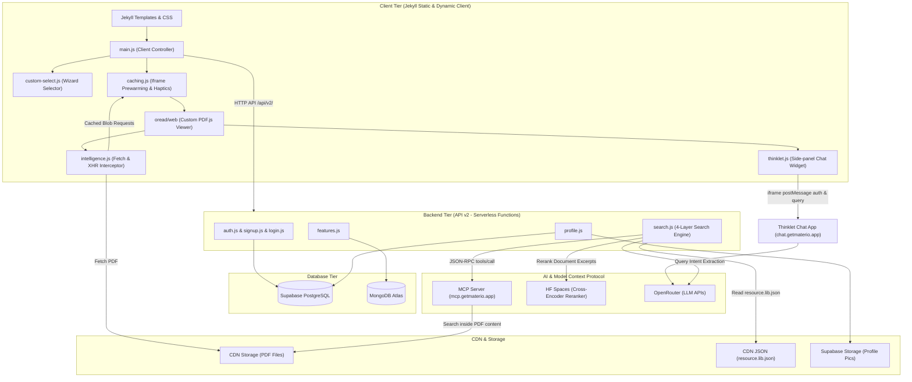
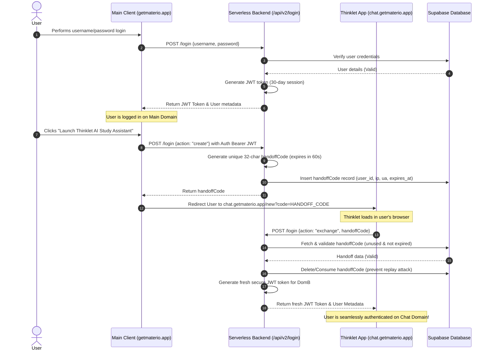

Have you ever wondered how Materio works? 

Imagine this: You tap a single dropdown on a study site, and instead of a generic browser menu, a sleek modal slides in, guiding you from your semester to your chosen chapter. You type "ml ch3" and instantly—without waiting for network lag—a custom PDF viewer opens, displaying your Machine Learning notes. You select a tricky sentence in the PDF, click "Ask AI," and a chatbot instantly reads it in context, using a secure session carried over from a completely different domain.

How does a website that builds as a static Jekyll blog behave like a state-of-the-art, lightning-fast, highly dynamic web application?

Grab your compass, because today we are setting out on an engineering adventure deep under the hood of Materio. We’ll explore the pipelines, the databases, the caching tricks, the telemetry trackers, the payments engine, and the security protocols that make the magic happen.

---

## 1. The Landscape: High-Level Architecture

At first glance, Materio’s frontend is a static page compiled via **Jekyll**. But behind that static facade lies a highly responsive, dynamic frontend engine powered by optimized vanilla JavaScript. 

When the client needs data, it doesn't query a monolith. Instead, it interacts with a distributed network of **Serverless API v2 functions** (hosted on Vercel/Netlify), which coordinate with **Supabase PostgreSQL** for relational records, **MongoDB** for dynamic configurations, a **Model Context Protocol (MCP) Server** for deep PDF searches, and **OpenRouter/HuggingFace Spaces** for AI intelligence.

Here is the blueprint of our modern web architecture:



---

## 2. The brain: The 4-Layer Search Pipeline

Finding study materials shouldn't feel like searching for a needle in a haystack. In Materio v5, the search engine was rebuilt from scratch to parse shorthand, handle spelling mistakes, and even peek *inside* PDF documents to extract semantic matches.

To achieve speed and accuracy, search queries flow through a **4-layer search pipeline** in [api/v2/search.js](file:///d:/v4/materio/api/v2/search.js):

1. **Layer 1: Direct Navigation (Regex Match)**  
   If you type `os ch4` or `ml unit 2`, the system bypasses search algorithms entirely. A regex pattern matches the subject abbreviation (`os` $\rightarrow$ Operating System) and the chapter index ($4 \rightarrow 3$), resolving the request instantly.
2. **Layer 2: BM25 Keyword Scorer**  
   If direct navigation misses, the system tokenizes the query and expands abbreviations (e.g., `qp` $\rightarrow$ Question Paper, `cn` $\rightarrow$ Computer Networks) using static lookup maps. It then runs an in-memory **BM25 algorithm** over the flattened resource library index.
3. **Layer 3: Fuse.js Fallback (Typo Tolerance)**  
   If the top BM25 score is weak (under $60\%$), the pipeline spins up **Fuse.js** as a fuzzy matcher fallback to handle keyboard slips.
4. **Layer 4: AI Mode (Deep Semantic Search)**  
   When **AI Mode** is turned on, the system performs a semantic search. It first parses query intent (using rules or an LLM call). It then issues a JSON-RPC request to our **MCP Server** running the `SnapSearch` tool. This server searches the indexed textual content *inside* the library PDFs. The retrieved document excerpts are passed through a **HuggingFace Cross-Encoder Reranker** model (`HF_RERANKER_URL`) to return the highest-quality references.

Here is the data flow diagram showing how search queries are routed:

```mermaid
graph TD
    User([User]) -- 1. Query "ml ch3" --> Client[Client UI]
    Client -- 2. Parse Query via Regex --> DirectNav{Direct Nav Match?}
    
    DirectNav -- Yes (ml ch3) --> OpenPDF[Directly Open PDF from CDN]
    DirectNav -- No (vague query) --> ApiSearch[API /api/v2/search]
    
    subgraph SearchPipeline ["Search Pipeline Serverless Function"]
        ApiSearch --> IntentExtractor[Intent Extractor]
        IntentExtractor -- Rule-Based Extraction --> VagueCheck{Is Vague?}
        
        VagueCheck -- Yes --> LLMIntent[LLM Query expansion / OpenRouter]
        VagueCheck -- No / Expanded --> BM25[BM25 Keyword Scorer]
        
        BM25 -- Scores resource.lib.json --> Bm25Confidence{Score >= 60?}
        Bm25Confidence -- No --> FuseFallback[Fuse.js Fuzzy Match Fallback]
        Bm25Confidence -- Yes --> MergeResults[Merge & Dedup Results]
        FuseFallback --> MergeResults
        
        MergeResults --> AISearchCheck{AI Mode enabled?}
        AISearchCheck -- No --> OutputResults[Return JSON Results]
        
        AISearchCheck -- Yes --> MCPQuery[MCP SnapSearch tool call]
        MCPQuery -- Deep searches inside PDFs --> McpRankings[Build MCP Rankings]
        McpRankings --> Reranker[HF Spaces Reranker Cross-Encoder]
        Reranker --> OutputResults
    end
    
    OutputResults -- 3. Show Results List --> Client
    Client -- 4. Click Result --> OpenPDF
    OpenPDF -- 5. Intercept Network Requests --> IntelCache[intelligence.js Cache Interceptor]
    IntelCache -- Cache Hit --> ServeLocal[Serve PDF from Local Blob Cache]
    IntelCache -- Cache Miss --> FetchCDN[Fetch PDF from CDN Network]
```

---

## 3. The Safe Passage: Secure Handoff Protocol

Authentication across multiple domains is a notorious security headache. Materio's primary site runs on `getmaterio.app`, while our AI study assistant, Thinklet, resides at `chat.getmaterio.app`. How do we log you into the chat workspace seamlessly without exposing your permanent password or security tokens in the URL?

We designed the **Secure Handoff Protocol**. 

Instead of passing JWTs in URL parameters (where they would leak into browser histories and referrer headers), we use a short-lived, single-use ticket stored in the database.

Here is the step-by-step transaction:



By immediately deleting the handoff code from the database upon verification, we ensure that even if an attacker intercepts the code, they cannot reuse it. 

---

## 4. The Magic Scroll: PDF Caching & Iframe Prewarming

PDF.js is a heavy library. Loading it alongside a large textbook can take seconds, frustrating a student in the middle of a study session. To make PDF loading feel instantaneous, Materio deploys a double-sided caching strategy: **Iframe Prewarming** in [caching.js](file:///d:/v4/materio/assets/scripts/caching.js) and **Fetch Interception** in [intelligence.js](file:///d:/v4/materio/oread/web/intelligence.js).

### Iframe Prewarming
Instead of waiting for you to select a PDF to load the viewer, `caching.js` spawns a hidden, detached iframe loading `/oread/web/viewer.html` off-screen, one second after the main page loads. 

When you click "Open PDF":
- The system doesn't create a new iframe. It moves the prewarmed iframe into the visible modal container.
- It sends a `postMessage({ type: 'loadFile', url: pdfUrl })` to the iframe.
- PDF.js receives the message and swaps the PDF file dynamically, cutting load times by up to $80\%$.

### Intercepting the Stream
But what about the network delay of downloading the PDF bytes? 

Inside the PDF.js iframe, our script `intelligence.js` overrides the global `window.fetch` and `XMLHttpRequest.prototype.send` APIs. When PDF.js requests the document, `intelligence.js` checks a global `Map` shared by the parent page containing pre-cached PDF binary arrays. 

If there is a cache hit, it slices the cached `ArrayBuffer` and serves a synthetic HTTP `200 OK` response directly, bypassing the network entirely! If it's a miss, it streams the PDF from the CDN and simultaneously caches it in memory for instant subsequent loads.

### Haptic-Synced Loading Progress
To make the technology feel tangible, we integrated a haptic feedback system tied directly to actual network chunk retrieval. As the PDF streams, the client fires small `25ms-45ms` vibrations at every $10\%$ progress increment, simulating data chunks falling into place. Once the file loads completely, a distinct success vibration plays.

### Session Rate Limiting
Studying is a marathon, not a sprint. To prevent automation scrapers while protecting resources, `caching.js` limits session PDF loads depending on user tiers (Free: 20 PDFs/session, Pro: 40, Admin: 100). Exceeding this triggers a strict 30-minute lockdown screen featuring an animated countdown timer.

---

## 5. The Scribe: Cloud-Synced Study Notebooks

Note-taking is integrated directly alongside reading. Our custom ESM editor module [notebook.js](file:///d:/v4/materio/assets/scripts/notebook.js) provides a rich-text notepad with markdown support, LaTeX/KaTeX formula rendering, and Highlight.js syntax highlighting.

### Intelligent Context Linking
When you open a note, the editor parses the active window's URL path segments (using params like `sem`, `sub`, and `topic`) to detect what textbook or chapter you are reading. It then automatically anchors your note to that specific document, allowing you to quickly reload the linked PDF with a single click.

### Hybrid Client-Cloud Syncing
The notebook uses a dual-persistence strategy:
1. **Local storage (`notebooks_db` or variables)**: Saves notes instantly as you type (debounced at 500ms) for zero latency.
2. **Cloud Sync Database (`collection.updateOne`)**: If you are a Pro (lifetime purchase) or Plus/Lite subscriber, the editor syncs note payloads to MongoDB Atlas via `/api/v2/features?action=notebooks`. If the server is unreachable, the editor silently caches notes in browser storage and flags them for synchronization once the server resumes.

---

## 6. The Tracker: Device Fingerprinting & Heartbeat Synchronization

Analytics are crucial for monitoring content demand. Instead of loading heavy third-party scripts, Materio runs a lightweight, custom telemetry client: [sync.js](file:///d:/v4/materio/assets/scripts/sync.js).

### Custom Device Fingerprinting
To identify clients without invasive tracking, the client generates a unique cryptographic hash from browser metrics:
```javascript
const fp = [
  navigator.userAgent,
  navigator.language,
  screen.colorDepth,
  screen.width + 'x' + screen.height,
  new Date().getTimezoneOffset(),
  navigator.platform,
  navigator.hardwareConcurrency
].join('###');
```
This fingerprint is hashed into a hexadecimal string and synchronized with a unique session ID.

### Idle-Aware Heartbeats
Rather than constant network pings, `sync.js` monitors user activity events (`mousemove`, `scroll`, `keypress`, `touchstart`). If the user goes idle (3 minutes for pages, 5 minutes for PDFs), tracking pauses. 

Active statistics—including cumulative reading duration per PDF name, clicks, and configuration settings—are cached and flushed in batches:
* **Background heartbeats**: Flushed every 3 minutes.
* **Page exit backups**: Flushed instantly using `navigator.sendBeacon` when the browser tab is closed or reloaded.
* **Failed Request Queue**: Saves pending telemetry payloads to `localStorage` (`materio_analytics_pending`) and retries transmission upon the next visit.

---

## 7. The Merchant: Payments & Subscription Lifecycle

Upgrading your account to Pro or Plus runs through our serverless payments module in [features.js](file:///d:/v4/materio/api/v2/features.js). 

### Price Verification & Verification HMAC
To prevent tampering (like users modifying prices in the browser console), the client only sends a plan identifier (`plan: pro_lifetime`). The server enforces static pricing lists directly:
* `plus_subscription`: ₹5900 (₹59.00 INR for 3 months)
* `pro_lifetime`: ₹29900 (₹299.00 INR lifetime)

Once the transaction completes, the server validates the cryptographic HMAC signature:
```javascript
const hmac = crypto.createHmac("sha256", RAZORPAY_KEY_SECRET);
hmac.update(razorpay_order_id + "|" + razorpay_payment_id);
const generatedSignature = hmac.digest("hex");
```
If signatures match, the user's tier is modified inside Supabase: Pro upgrades set `is_plus_user = true`, while Plus subscriptions set `is_lite_user = true` with a `lite_expiry` timestamp.

---

## 8. The Bridge: Personal Google Drive Integration

For students who want to maintain their own personal cloud libraries, Materio links directly to Google Drive API v3. 

1. **OAuth Verification**: The backend generates a secure Google login URL. After confirmation, the OAuth callback exchanges authorization codes for refresh tokens, storing them in the `google_drive_tokens` table.
2. **File Mapping**: The backend connects to the client's Drive, automatically creates a dedicated folder named `Materio`, and streams or lists PDF files directly inside it.

---

## 9. The Canvas: Interactive Wallpaper Engine

A pleasant aesthetic is vital for focus. Our client wallpaper script [advanced.js](file:///d:/v4/materio/assets/scripts/advanced.js) manages an interactive theme engine:

* **Dynamic Wallpaper Cycles**: Automatically transitions the website background through 9 distinct theme phases (dawn, sunrise, morning, afternoon, sunset, dusk, evening, night, midnight) to match the natural light outside your window.
* **Sereine Carousel**: Dynamically pulls random high-resolution wallpapers from `sereine.vercel.app`, allowing users to adjust change frequencies (every visit, daily, weekly), save images, and display artist credits.
* **Custom Image Upload**: Lets users upload custom wallpapers. The browser compresses the image to fit storage limitations and saves it into local collection grids.

---

## 10. The Vault: Relational Database Schema

Materio uses **Supabase (PostgreSQL)** as its primary transactional database. It stores everything related to user profiles, invites, one-time passwords, and security handoffs.

Let's look at the database schema and foreign-key relationships:

```mermaid
erDiagram
    users {
        uuid id PK
        string username UNIQUE
        string display_name
        string email UNIQUE
        string password "hashed"
        string recovery_key
        boolean has_admin_privileges
        boolean is_pro_user
        boolean is_plus_user
        boolean is_lite_user
        timestamp plus_expiry
        timestamp lite_expiry
        timestamp subscription_expiry
        string branch
        integer current_year
        integer passout_year
        string specialization
        string university_roll_no
        string profile_picture
        timestamp created_at
        timestamp updated_at
    }

    otps {
        uuid id PK
        string email
        string otp
        string type "signup / recovery"
        timestamp expires_at
        timestamp created_at
    }

    invites {
        uuid id PK
        string code UNIQUE
        boolean redeemed
        uuid redeemed_by FK
        timestamp redeemed_date
        timestamp expires_at
        boolean contains_plus_perks
    }

    sharelinks {
        integer id PK
        string invite_code FK,UNIQUE
        text custom_heading
        uuid created_by FK
        timestamp created_at
        timestamp updated_at
    }

    handoff_codes {
        string code PK
        string token
        uuid user_id FK
        string user_agent
        string ip_address
        timestamp expires_at
        boolean used
    }

    users ||--o{ invites : "redeems"
    users ||--o{ sharelinks : "creates"
    invites ||--o| sharelinks : "customizes"
    users ||--o{ handoff_codes : "requests"
```

### Security via PostgreSQL RLS
To guarantee user privacy, we enable **Row-Level Security (RLS)** on tables like `sharelinks`. The database policy restricts read/write operations to authenticated sessions matching the owner:
```sql
CREATE POLICY sharelinks_policy ON sharelinks
    FOR ALL
    TO authenticated
    USING (created_by = auth.uid())
    WITH CHECK (created_by = auth.uid());
```

---

## 11. The Wizard: Dropdown Navigation Modal

Have you noticed how smooth selecting a chapter is? Traditional select dropdowns are clunky, especially on mobile. Materio solves this with a custom dropdown modal wizard implemented in [custom-select.js](file:///d:/v4/materio/assets/scripts/custom-select.js).

The script intercepts native clicks on `<select>` elements and summons a unified modal that acts as a selector wizard:
* **Automatic Progression**: As soon as you select a Semester, the wizard automatically transitions to the Subject pane. Select a Subject, and it slides to Categories.
* **Typo & Search Integration**: A search box inside the selector allows you to swap to AI Search / Finder Mode at any point.
* **Native Gestures**: On mobile, the modal supports touch swipe-down gestures to dismiss.
* **Keyboard Navigation**: You can use `ArrowUp`, `ArrowDown`, and `Enter` to navigate the options, making it fully accessible for desktop power users.

---

## Conclusion: Engineering for Students

Materio is more than just static HTML pages; it is a carefully orchestrated system designed for speed, security, and portability. By blending a static Jekyll frontend with a highly optimized serverless backend, in-memory search scoring, prewarmed iframes, cloud notebooks, background telemetry, and cross-domain handoffs, we have built a library that is always ready to study.

Next time you open a study guide or review an exam card, you'll know exactly which gears are turning behind the screen!

*What part of Materio's architecture would you like us to document next? Let us know in the comments below!*
