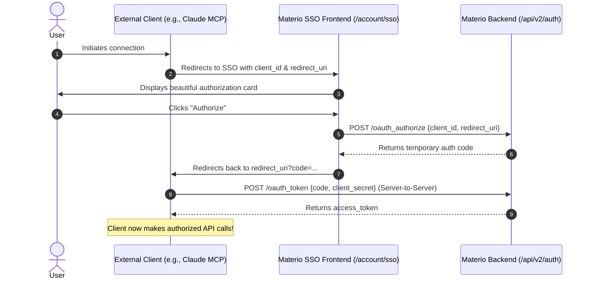

In order to allow external services, AI agents, and Model Context Protocol (MCP) servers to securely interact with user data, we have completely revamped our authentication layer. Materio now supports standard **OAuth 2.0 Authorization Code Flows** alongside a dedicated, standalone **Single Sign-On (SSO)** portal.

If you are a developer or an AI agent looking to integrate with Materio, this guide will walk you through the architecture and the steps required to authenticate successfully.

---

## 1. The Architecture: Standalone SSO

Previously, SSO logic was heavily coupled with our main account profile logic. In the new architecture, the SSO flow has been isolated into its own dedicated directory at `getmaterio.app/account/sso`. 

When an external application needs authorization, the user is redirected to this secure `/account/sso` portal. If the user is unauthenticated, they will be prompted to log in; if they are already logged in, the system uses a seamless session handoff to present an authorization card without requiring them to type their credentials again.



---

## 2. Registering Your Application

Before you can initiate the OAuth flow, you must register your application to obtain credentials. 

While the developer portal dashboard is being built, applications are registered via the `/api/v2/auth?action=oauth_register_app` endpoint using an existing user's session token.

When registered, you will receive:
* **`client_id`**: Public identifier for your app (starts with `client_`).
* **`client_secret`**: Secret key used in the token exchange (starts with `secret_`). Do NOT expose this to the browser.
* **`redirect_uri`**: The exact callback URL where Materio will send the user after authorization.

---

## 3. Implementing the Flow (Example: MCP Server)

If you are building an [MCP (Model Context Protocol)](https://modelcontextprotocol.io) server to allow AI assistants (like Claude) to access Materio, integrating the OAuth flow is plug-and-play.

### Step A: Configure the Endpoints
Your MCP server (or any OAuth client) needs to be configured with Materio's endpoints:
- **Authorization URL:** `https://getmaterio.app/account/sso`
- **Token URL:** `https://getmaterio.app/api/v2/auth?action=oauth_token`
- **Grant Type:** `authorization_code`

### Step B: The Authorization Redirect
Your client should construct a URL and redirect the user's browser to:
```text
https://getmaterio.app/account/sso
  ?client_id=YOUR_CLIENT_ID
  &redirect_uri=YOUR_REGISTERED_CALLBACK
  &response_type=code
```

*(Note: Standard PKCE parameters like `code_challenge`, `code_challenge_method`, and `state` are natively supported. They will be safely parsed and the `state` parameter will be preserved and passed back to your callback.)*

### Step C: The Token Exchange
When the user approves the request, Materio will redirect them back to your `redirect_uri` with a `?code=...` parameter (and `state` if provided). 

Your server must immediately exchange this code for an access token by making a `POST` request. Materio supports both JSON bodies and standard OAuth 2.0 `application/x-www-form-urlencoded` payloads with `Authorization: Basic` headers (which most AI clients like Claude and Perplexity use by default):

```javascript
const credentials = btoa('YOUR_CLIENT_ID:YOUR_CLIENT_SECRET');

const response = await fetch('https://getmaterio.app/api/v2/auth?action=oauth_token', {
  method: 'POST',
  headers: {
    'Content-Type': 'application/x-www-form-urlencoded',
    'Authorization': `Basic ${credentials}`
  },
  body: new URLSearchParams({
    grant_type: 'authorization_code',
    code: 'code_received_from_url',
    redirect_uri: 'YOUR_REGISTERED_CALLBACK'
  })
});

const data = await response.json();
// data.access_token contains your Bearer token!
```

---

## 4. Making Authenticated Requests

Once you have the `access_token`, you can make requests to any protected Materio API endpoint by including it in the `Authorization` header.

```javascript
const profileResponse = await fetch('https://getmaterio.app/api/v2/profile', {
  headers: {
    'Authorization': `Bearer ${access_token}`,
    'Content-Type': 'application/json'
  }
});
```

Tokens are secure JWTs containing user identity context and are subject to standard expiration and revocation policies.

---

## 5. Security Considerations

- **Strict Redirect URI Matching**: To prevent token hijacking, the `redirect_uri` provided during the authorization step and the token exchange step must *exactly* match the URI registered to the `client_id`.
- **Short-Lived Codes**: Authorization codes expire after 5 minutes and can only be used once.
- **SSRF Protections**: Our OAuth infrastructure strictly prevents open redirects and validates `redirect_uri` domains internally.

With this new OAuth implementation, building automated study bots, external search indexing tools, or desktop integrations for Materio is more secure and reliable than ever before. Happy building!
