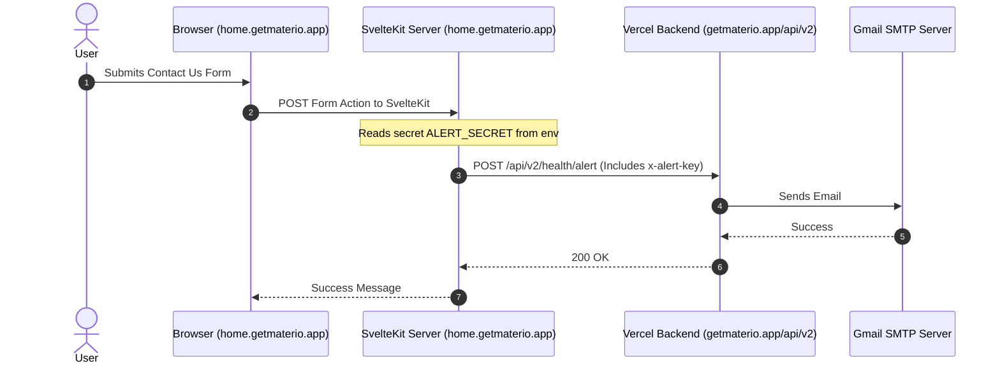

This guide explains how the mailing system is configured on the backend (`getmaterio.app`), how its endpoints are exposed, and how to securely send emails or log newsletter signups from your SvelteKit landing page (`home.getmaterio.app`).

---

## 1. Overview of the Backend Mailing System

The backend email functionality is powered by [mailer.js](file:///d:/v4/materio/api/_utils_shared/mailer.js) and sends emails via Gmail SMTP using `nodemailer`.

### Exposed Endpoints in `/api/v2`

The backend exposes two main API routes related to mailing (configured via `vercel.json` rewrites):

1. **`POST /api/v2/health/report` (Public)**:
   * **Purpose**: Submits bug reports/feedback.
   * **Behavior**: Saves reports to a MongoDB collection (`bug_reports`). If multiple reports cluster within a few hours, it triggers automated incident alert emails. If MongoDB is down, it immediately sends a fallback email to the administrator.
2. **`POST /api/v2/health/alert` (Protected)**:
   * **Purpose**: Sends custom alert or messaging emails.
   * **Behavior**: Sends custom HTML/plain-text emails to a designated address.
   * **Security**: **Requires an authentication header** `x-alert-key` that must match the backend's `ALERT_SECRET` environment variable to prevent public spam abuse.

---

## 2. Secure Architecture for SvelteKit Landing Page

Because the `/api/v2/health/alert` endpoint requires the `ALERT_SECRET` API key:
* **Never call this endpoint directly from browser-side JavaScript.** Doing so would expose your `ALERT_SECRET` in the browser network tab, enabling malicious actors to abuse your SMTP server to send spam.

### The Server-Side Proxy Pattern (Recommended)

Since your landing page is built using **SvelteKit**, you can leverage SvelteKit's server runtime (`+page.server.ts` or `+server.ts` routes) to act as a secure proxy. The client submits data to SvelteKit, which forwards it to the Vercel backend using the private secret.



---

## 3. Implementation: Contact Us Form

This scenario shows how to implement a secure Contact Us form that emails submissions to the administrators.

### Step 1: Create the Server-Side Form Action (`+page.server.ts`)

Create or edit the page server file corresponding to your contact route:

```typescript
// src/routes/contact/+page.server.ts
import { fail } from '@sveltejs/kit';
import { env } from '$env/dynamic/private'; // Keeps secrets secure

export const actions = {
  default: async ({ request }) => {
    const data = await request.formData();
    const email = data.get('email')?.toString().trim();
    const name = data.get('name')?.toString().trim();
    const message = data.get('message')?.toString().trim();

    // 1. Validation
    if (!email || !name || !message) {
      return fail(400, { error: 'All fields are required.' });
    }

    // 2. Fetch API Secrets
    const ALERT_SECRET = env.ALERT_SECRET || '';
    const BACKEND_API_URL = 'https://getmaterio.app/api/v2/health/alert';

    try {
      // 3. Proxy request to Vercel backend
      const response = await fetch(BACKEND_API_URL, {
        method: 'POST',
        headers: {
          'Content-Type': 'application/json',
          'x-alert-key': ALERT_SECRET // Authenticates with SMTP server
        },
        body: JSON.stringify({
          subject: `Contact Form Submission from ${name}`,
          severity: 'minor', // Severity style for email template
          message: `Name: ${name}\nEmail: ${email}\n\nMessage:\n${message}`,
          to: env.ALERT_EMAIL // Optional override, defaults to SMTP_EMAIL
        })
      });

      if (!response.ok) {
        const err = await response.json();
        return fail(500, { error: err.error || 'Failed to dispatch email.' });
      }

      return { success: true, message: 'Your message has been sent successfully!' };
    } catch (err: any) {
      return fail(500, { error: 'Network error. Please try again later.' });
    }
  }
};
```

### Step 2: Create the Frontend Svelte Form (`+page.svelte`)

Use the standard SvelteKit `enhance` action to handle submission asynchronously without page reloads.

```svelte
<!-- src/routes/contact/+page.svelte -->
<script lang="ts">
  import { enhance } from '$app/forms';

  let { form } = $props(); // Form action response state
  let loading = $state(false);
</script>

<div class="max-w-md mx-auto p-6 bg-white rounded-xl shadow-md">
  <h2 class="text-xl font-bold mb-4">Contact Us</h2>

  {#if form?.error}
    <div class="p-3 mb-4 text-sm text-red-700 bg-red-100 rounded-lg">{form.error}</div>
  {/if}

  {#if form?.success}
    <div class="p-3 mb-4 text-sm text-green-700 bg-green-100 rounded-lg">{form.message}</div>
  {/if}

  <form method="POST" use:enhance={() => {
    loading = true;
    return async ({ update }) => {
      loading = false;
      await update();
    };
  }} class="space-y-4">
    <div>
      <label for="name" class="block text-sm font-semibold">Name</label>
      <input id="name" name="name" type="text" required class="w-full p-2 border rounded-md" />
    </div>

    <div>
      <label for="email" class="block text-sm font-semibold">Email</label>
      <input id="email" name="email" type="email" required class="w-full p-2 border rounded-md" />
    </div>

    <div>
      <label for="message" class="block text-sm font-semibold">Message</label>
      <textarea id="message" name="message" rows="4" required class="w-full p-2 border rounded-md"></textarea>
    </div>

    <button type="submit" disabled={loading} class="w-full py-2 bg-cream-dark text-white font-semibold rounded-md hover:bg-neutral-800 disabled:opacity-50">
      {loading ? 'Sending...' : 'Send Message'}
    </button>
  </form>
</div>
```

---

## 4. Implementation: Newsletter Signup

Currently, there is no database collection or API endpoint dedicated to news subscription on the backend. You can either implement it using your shared Supabase setup (saving emails directly) or proxy the signup to save details in MongoDB.

### Step 1: Create a Database collection (Server-Side)
You can directly insert subscriber emails into Supabase or MongoDB from SvelteKit, as both projects share Supabase keys.

```typescript
// src/routes/api/newsletter/+server.ts
import { json } from '@sveltejs/kit';
import { createClient } from '@supabase/supabase-js';
import { env } from '$env/dynamic/private';

// Initialize shared Supabase Client
const supabase = createClient(env.SUPABASE_URL, env.SUPABASE_SERVICE_KEY);

export async function POST({ request }) {
  const { email } = await request.json();

  if (!email || !email.includes('@')) {
    return json({ error: 'Valid email is required' }, { status: 400 });
  }

  // Save directly to a Supabase table (e.g., newsletter_subscribers)
  const { error } = await supabase
    .from('newsletter_subscribers')
    .insert([{ email, subscribed_at: new Date().toISOString() }]);

  if (error) {
    if (error.code === '23505') { // Unique constraint violation (already subscribed)
      return json({ message: 'You are already subscribed!' }, { status: 200 });
    }
    return json({ error: error.message }, { status: 500 });
  }

  // OPTIONAL: Send a welcome confirmation email via Vercel SMTP
  try {
    await fetch('https://getmaterio.app/api/v2/health/alert', {
      method: 'POST',
      headers: {
        'Content-Type': 'application/json',
        'x-alert-key': env.ALERT_SECRET
      },
      body: JSON.stringify({
        subject: 'Welcome to the Materio Newsletter!',
        to: email,
        message: 'Thank you for subscribing to our newsletter! We will keep you updated on features and updates.'
      })
    });
  } catch (err) {
    console.error('Welcome email failed to send', err);
  }

  return json({ success: true, message: 'Subscribed successfully!' });
}
```
