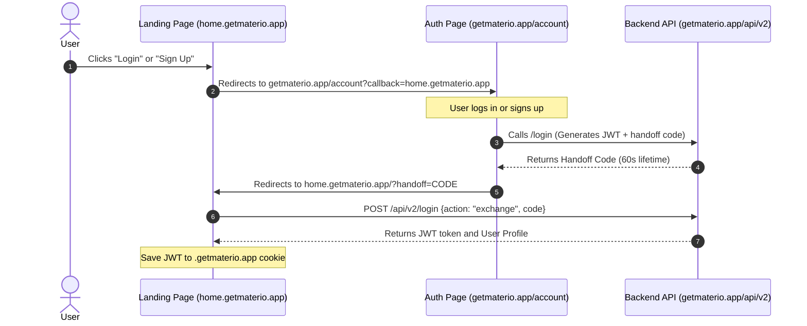

This guide explains how the authentication flow operates between the landing page (`home.getmaterio.app`) and the main application (`getmaterio.app`), verifies the accuracy of the updated v2 API endpoints, and details how to implement the integration.

---

## 1. Domain Authentication Flow: SSO vs. Direct

Because both the landing page (`home.getmaterio.app`) and the main application (`getmaterio.app`) share the same primary domain (`getmaterio.app`), the authentication flow can operate **Directly via a Shared Cookie Flow** rather than requiring users to go through an external OAuth/SSO consent screen.

### How Cookie Sharing Works
1. **Wildcard Cookie Domain**: Cookies set with a leading dot on the parent domain (e.g. `domain=.getmaterio.app`) are sent by the browser to all subdomains under `getmaterio.app` (including `home.getmaterio.app` and the main site).
2. **Token Synchronization**: In the main application's authentication script (`auth.js`), there is a synchronization routine that automatically copies the token from cookies into `localStorage` if it's missing:
   ```javascript
   if (cookieToken && !localStorageToken) {
     const token = cookieToken.split('=')[1];
     localStorage.setItem('materio_auth_token', token);
   }
   ```
3. **Implication**: Any action that logs in a user on the landing page (`home.getmaterio.app`) and sets the `materio_auth_token` cookie for the `.getmaterio.app` domain will **automatically authenticate** the user when they navigate to the main app at `getmaterio.app`.

---

## 2. Integrating via the Callback Redirection Flow

If you want to delegate authentication to the main site's login page rather than rebuilding forms, you can use the `?callback` redirect flow.



### Redirection Behavior: SSO Screen Bypass
* **If it is NOT recognized as same-site**: The user is redirected to the SSO authorize screen `/account/sso/` and must click **Authorize Application** before being redirected back.
* **If it IS recognized as same-site**: The authorization screen is bypassed. Immediately after log in, the user is redirected back to `https://home.getmaterio.app?handoff=CODE` seamlessly.

To make the redirection seamless, the `isSameSiteCallback` helper check in the main app is configured to recognize all subdomains of `getmaterio.app`:
```javascript
function isSameSiteCallback(callbackUrl) {
  if (!callbackUrl) return false;
  if (callbackUrl.startsWith('/') || callbackUrl.startsWith('.')) return true;
  
  try {
    const url = new URL(callbackUrl, window.location.origin);
    if (url.hostname === 'getmaterio.app' || url.hostname.endsWith('.getmaterio.app')) {
      return true;
    }
  } catch (e) {
    return true;
  }
  return false;
}
```

---

## 3. Audited API Endpoints

### A. One-Time Password (OTP) Generation
Used to send a 6-digit verification code to the user's university email before signup.
* **Endpoint**: `POST /api/v2/auth?action=otp`
* **Content-Type**: `application/json`
* **Request Body**:
  ```json
  {
    "email": "2203051057100@paruluniversity.ac.in",
    "type": "signup"
  }
  ```
* **Validation**: Only students with `@paruluniversity.ac.in` email addresses are allowed for signup.

### B. User Registration (Signup)
Creates a new user record.
* **Endpoint**: `POST /api/v2/signup`
* **Content-Type**: `application/json`
* **Request Body**:
  ```json
  {
    "username": "johndoe",
    "displayName": "John Doe",
    "email": "2203051057100@paruluniversity.ac.in",
    "password": "securePassword123",
    "otp": "123456",
    "inviteCode": "OPTIONAL_GIFT_CODE",
    "branch": "Computer Science and Engineering",
    "currentYear": 3,
    "passoutYear": 2027,
    "specialization": "Artificial Intelligence",
    "profilePicture": "data:image/png;base64,..."
  }
  ```

### C. Authentication (Login)
Supports credentials-based login or OTP passwordless login.
* **Endpoint**: `POST /api/v2/login`
* **Content-Type**: `application/json`
* **Request Body (Password)**:
  ```json
  {
    "username": "johndoe",
    "password": "securePassword123",
    "method": "password"
  }
  ```

### D. Logout
Clears authentication states.
* **Endpoint**: `POST /api/v2/auth?action=logout`
* **Behavior**: Clears the `materio_auth_token` cookie for both `/` and `.getmaterio.app` domains, executes a client-side localStorage clean script, and redirects back to the landing page.

---

## 4. Implementation Steps for the SvelteKit Landing Page

To implement session management on the SvelteKit landing page:

### Step 1: Create a Helper Utility (`src/lib/auth.ts`)
```typescript
export const COOKIE_NAME = 'materio_auth_token';
export const USER_KEY = 'materio_user';

export function getCookie(name: string): string | null {
  if (typeof document === 'undefined') return null;
  const value = `; ${document.cookie}`;
  const parts = value.split(`; ${name}=`);
  if (parts.length === 2) return parts.pop()?.split(';').shift() || null;
  return null;
}

export function setAuthCookie(token: string) {
  const expiryDate = new Date();
  expiryDate.setDate(expiryDate.getDate() + 30); // 30 days
  let cookieString = `${COOKIE_NAME}=${token}; path=/; expires=${expiryDate.toUTCString()}; SameSite=Lax; Secure`;
  if (window.location.hostname.endsWith('getmaterio.app')) {
    cookieString += '; domain=.getmaterio.app';
  }
  document.cookie = cookieString;
}

export function clearAuthCookie() {
  let cookieString = `${COOKIE_NAME}=; path=/; expires=Thu, 01 Jan 1970 00:00:00 GMT; SameSite=Lax; Secure`;
  if (window.location.hostname.endsWith('getmaterio.app')) {
    cookieString += '; domain=.getmaterio.app';
  }
  document.cookie = cookieString;
  localStorage.removeItem(USER_KEY);
}
```

### Step 2: Handle Handoff Param and Verify State inside Svelte Component
On Svelte mount, check for the redirect parameters, request the token from the backend, and persist the cookie:

```html
<script lang="ts">
  import { onMount } from 'svelte';
  import { getCookie, setAuthCookie, clearAuthCookie, USER_KEY } from '$lib/auth';

  let user = $state<any>(null);

  onMount(async () => {
    const urlParams = new URLSearchParams(window.location.search);
    const handoffCode = urlParams.get('handoff');

    if (handoffCode) {
      try {
        const response = await fetch('https://getmaterio.app/api/v2/login', {
          method: 'POST',
          headers: { 'Content-Type': 'application/json' },
          body: JSON.stringify({ action: 'exchange', code: handoffCode })
        });
        if (response.ok) {
          const data = await response.json();
          if (data.token) {
            setAuthCookie(data.token);
            if (data.user) {
              user = data.user;
              localStorage.setItem(USER_KEY, JSON.stringify(data.user));
            }
          }
        }
      } catch (err) {
        console.error('Failed to exchange handoff code:', err);
      } finally {
        urlParams.delete('handoff');
        const cleanUrl = window.location.pathname + (urlParams.toString() ? `?${urlParams.toString()}` : '');
        window.history.history.replaceState({}, '', cleanUrl);
      }
    } else {
      const cookieToken = getCookie('materio_auth_token');
      const cachedUser = localStorage.getItem(USER_KEY);
      if (cookieToken && cachedUser) {
        user = JSON.parse(cachedUser);
      }
    }
  });

  function handleLoginRedirect() {
    const callbackUrl = window.location.origin + '/';
    window.location.href = `https://getmaterio.app/account?callback=${encodeURIComponent(callbackUrl)}`;
  }
</script>
```
